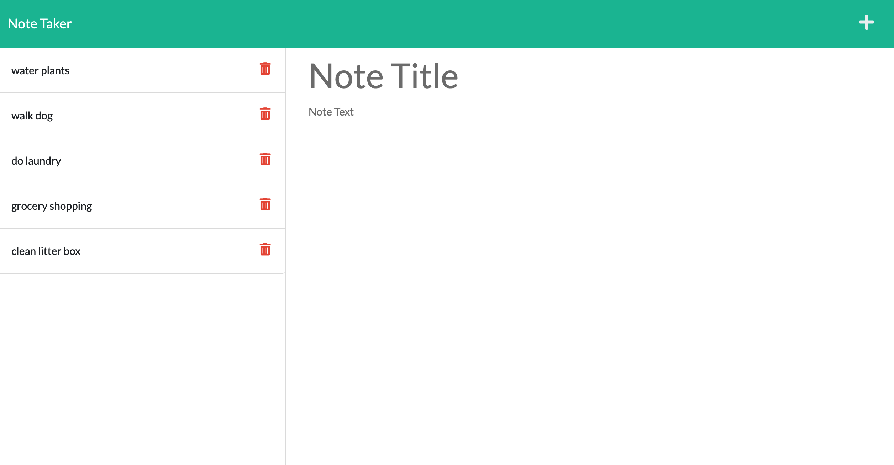

# Note Taker

## Description
An application for writing and saving notes. The app uses an Express.js backend and saves and retrieves note data from a JSON file.
  
## Table of Contents
- [Installation](#installation)
- [Usage](#usage)
- [Contributing](#contributing)
- [Tests](#test)
- [License](#license)
- [Questions](#questions)
  
## Installation
Run `npm i` to install dependencies, then run `npm start`
  
## Usage

 
## License
Learn more about [MIT](https://choosealicense.com/licenses/mit/).
  
## Questions
GitHub Username: aberger3647

You can reach me with any questions at aberger3647@gmail.com.